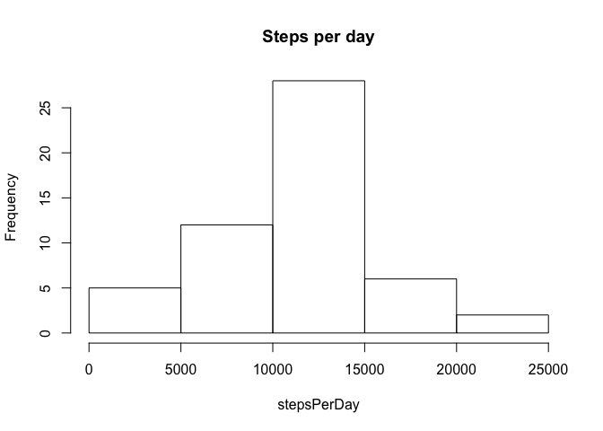
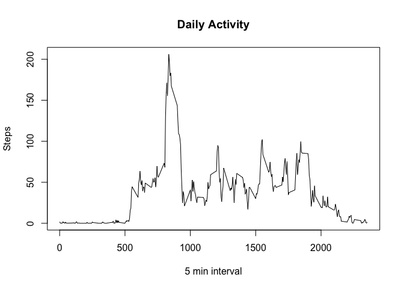
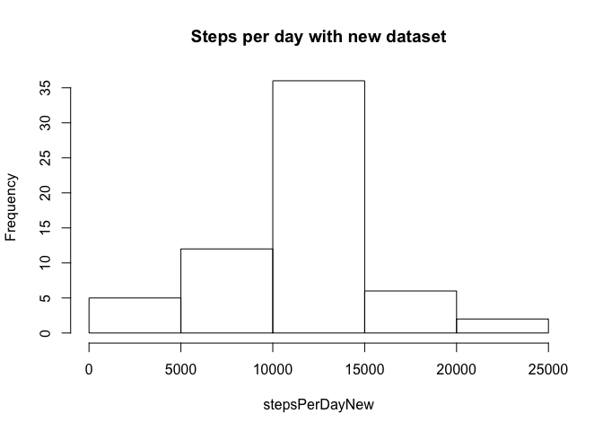
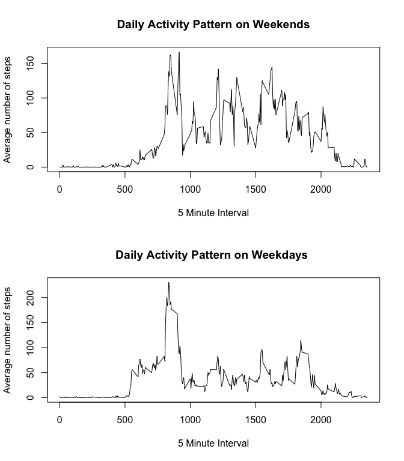

# RepData_Assignment1
Pallavi Gadgil  
4/16/2017  

## R Markdown
It is now possible to collect a large amount of data about personal movement using activity monitoring devices such as a Fitbit, Nike Fuelband, or Jawbone Up. These type of devices are part of the "quantified self" movement -- a group of enthusiasts who take measurements about themselves regularly to improve their health, to find patterns in their behavior, or because they are tech geeks. 

This assignment makes use of data from a personal activity monitoring device. This device collects data at 5 minute intervals through out the day. The data consists of two months of data from an anonymous individual collected during the months of October and November, 2012 and include the number of steps taken in 5 minute intervals each day.

The variables included in this dataset are:

steps: Number of steps taking in a 5-minute interval (missing values are coded as NA)

date: The date on which the measurement was taken in YYYY-MM-DD format

interval: Identifier for the 5-minute interval in which measurement was taken

The dataset is stored in a comma-separated-value (CSV) file and there are a total of 17,568 observations in this dataset.


##Loading and preprocessing the data

###Load the Data
The following code will set the working Directory, read the .csv file and remove all NAs from the data.

```r
setwd("~/Documents/pallavi/datascience/jhopdata")
  dataFrameTotal <- read.csv("./data/activity.csv",colClasses=c("numeric","character","numeric"))

dataFrame <-dataFrameTotal[complete.cases(dataFrameTotal),]
```
### Format the data
The following code will format the date to YYYY-MM-DD and categorize the steps.


```r
dataFrame$date <- as.Date(dataFrame$date, format = "%Y-%m-%d")
dataFrame$interval <- as.factor(dataFrame$interval)
```
##What is mean total number of steps taken per day?
### First step is to arrange the data by day/

```r
stepsPerDay<-tapply(dataFrame$steps, dataFrame$date, sum)
```
### Draw the histogram

```r
options(scipen = 1,digits=2)
hist(stepsPerDay, main = "Steps per day")
```

<!-- -->
###Calculate Mean and Median


```r
stepMean <- mean(stepsPerDay)
stepMedian <- median(stepsPerDay)
stepMean
```

```
## [1] 10766
```

```r
stepMedian
```

```
## [1] 10765
```
Total number of steps taken mean : **10766.19** and median : **10765**

## What is the average daily activity pattern?

###Time series plot

```r
actvityPerDay<-tapply(dataFrame$steps, dataFrame$interval, mean)
plot(y = actvityPerDay, x = names(actvityPerDay), type = "l", xlab="5 min interval",ylab="Steps" , main = "Daily Activity")
```

<!-- -->
###5 minute interval which contains maximum number of Steps

```r
actvityPerDay[actvityPerDay==max(actvityPerDay)]
```

```
## 835 
## 206
```

##Imputing missing values

###Calculate and report the total number of missing values in the dataset (i.e. the total number of rows with NAs)


```r
sum(!complete.cases(dataFrameTotal))
```

```
## [1] 2304
```

###Filling up data for NA values

```r
dataFrameNew <- dataFrameTotal
dataFrameNew[which(is.na(dataFrameNew$steps)),1]<-actvityPerDay[as.character(dataFrameNew[which(is.na(dataFrameNew$steps)),3])]
```
###Verify no NA values

```r
sum(!complete.cases(dataFrameNew))
```

```
## [1] 0
```
###Making Histogram with new values

```r
stepsPerDayNew<-tapply(dataFrameNew$steps, dataFrameNew$date, sum)
hist(stepsPerDayNew, main = "Steps per day with new dataset")
```

<!-- -->

```r
stepMeanNew <- mean(stepsPerDayNew)
stepMedianNew <- median(stepsPerDayNew)
```

Total number of steps taken  with new data set mean : **10766.19** and median : **10766.19**

Impact of missing values on mean is **0** and on median is **1.19**

##Are there differences in activity patterns between weekdays and weekends?


```r
str(dataFrameNew)
```

```
## 'data.frame':	17568 obs. of  3 variables:
##  $ steps   : num  1.717 0.3396 0.1321 0.1509 0.0755 ...
##  $ date    : chr  "2012-10-01" "2012-10-01" "2012-10-01" "2012-10-01" ...
##  $ interval: num  0 5 10 15 20 25 30 35 40 45 ...
```

```r
  dataFrameNew$weekDay <- weekdays(as.Date(dataFrameNew$date))
dataFrameNew$weekDayFactor<- as.factor(c("weekend", "weekday"))
dataFrameNew[dataFrameNew$weekDay == "Sunday" | dataFrameNew$weekDay == "Saturday" ,5]<- factor("weekend")
dataFrameNew[!(dataFrameNew$weekDay == "Sunday" | dataFrameNew$weekDay == "Saturday"),5 ]<- factor("weekday")
```

### panel plot containing a time series plot for Weekends and Weekdays

```r
weekdEndDF <- subset(dataFrameNew, weekDayFactor == "weekend") 
weekdDayDF <- subset(dataFrameNew, weekDayFactor == "weekday") 
weekdEndActivity<-tapply(weekdEndDF$steps, weekdEndDF$interval, mean)
weekDayActivtity<-tapply(weekdDayDF$steps, weekdDayDF$interval, mean)
par(mfrow=c(2,1))
plot(y = weekdEndActivity, x = names(weekdEndActivity), type = "l", xlab = "5 Minute Interval", ylab = "Average number of steps",
     main = "Daily Activity Pattern on Weekends")
plot(y = weekDayActivtity, x = names(weekDayActivtity), type = "l", xlab = "5 Minute Interval", 
     ylab = "Average number of steps",main = "Daily Activity Pattern on Weekdays ")
```

<!-- -->
